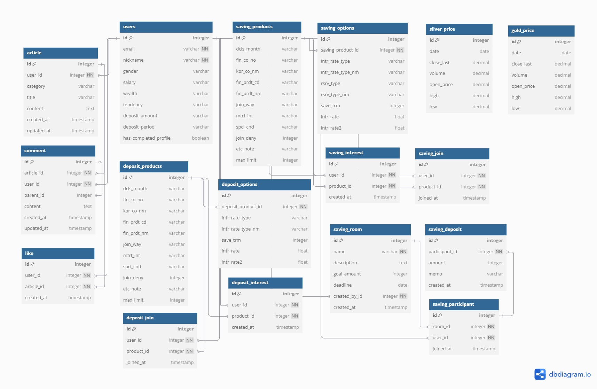

# 📌 FINAL PJT: 종합 금융 플랫폼 🏦

## 프로젝트 개요

**개인 맞춤형 금융 서비스와 협업 저축을 한 번에!**  
AI 기반 예·적금 추천, 공동 저축방, 실시간 금/은 시세, 지도 기반 은행 검색 등을 제공하는 종합 금융 플랫폼입니다.

---

## 👥 팀원 정보

| 이름   | 역할       | 담당 업무 |
|--------|------------|--------------------------------------------------|
| 윤선호 | 백엔드     | - 코사인 유사도 기반 AI 추천 알고리즘 구현<br>- 현물 시세 시스템 개발<br>- 회원가입, 로그인, Google 소셜 로그인<br>- 더미 데이터 생성<br>- ERD<br>- Websocket 기반 실시간 저축 공유방 구현(백)<br>  |
| 서지원 | 프론트엔드 | - UI/UX 디자인<br>- 컴포넌트 설계<br>- 게시판 CRUD<br>- 금융 상품 비교<br>- 지도 검색 페이지 개발<br>- Websocket 기반 실시간 저축 공유방 구현(프론트엔드)<br>  |

---

## 🏗️ 시스템 아키텍처

**메인 기능 구성 (navbar)**

- **예·적금 추천**: 전체 상품 조회, 사용자 맞춤형 추천, 찜/가입 기능 제공  
- **커뮤니티**: 예·적금 후기, 절약 팁, 자유게시판 (게시글 CRUD)  
- **공동 저축**: WebSocket 기반 실시간 저축 현황 공유, 목표 시각화  
- **주식 정보**: 유튜브 API로 주식 관련 영상 검색 및 출력  
- **현물 시세**: 금/은 시세 그래프 조회 (Chart.js)  
- **지도 검색**: 카카오맵 API 연동, 지역/은행 기반 위치 검색

---
## 데이터베이스 모델링


## 🧠 금융 상품 추천 알고리즘

**추천 프로세스 (4단계)**

1. 사용자 프로필 벡터화 (연령, 자산, 투자 성향 등 → 256차원 벡터)
2. 코사인 유사도 기반 유사 사용자 군집화
3. 하이브리드 필터링 (협업 70% + 콘텐츠 기반 30%)
4. ChatGPT API 활용, 추천 사유 자연어 생성

**기술적 장점**

- 사용자 행동 기반 개인화 추천
- AI 기반 설명 제공 → 신뢰도 & UX 향상
- 실무 적용 가능성 높은 구조

---

## ✨ 대표 기능 설명

### 🔹 예·적금 상품
- 저축 기간별 금리/우대금리 확인
- 찜/가입 기능 (마이페이지 연동)
- 필터링 & 정렬 기능 (이율, 찜 수, 가입 수 등)
- 회원 맞춤형 예·적금 상품 3개씩 추천

### 🔹 커뮤니티
- 후기/절약팁/자유게시판 3개 카테고리
- 글쓰기, 댓글, 좋아요 (회원 전용)
- 수정/삭제 (작성자 전용), 게시판 정렬 & 검색 기능

### 🔹 공유 저축방
- 방 생성 및 검색, WebSocket 실시간 입금 공유
- 저축 목표 설정 및 시각화
- 메모/응원 메시지 기능
- 참가자별 입금 내역 확인

### 🔹 주식 정보
- 키워드 기반 유튜브 API 검색 → 영상 + 상세 설명 제공

### 🔹 현물 시세
- 금/은 시세 엑셀 → DB 적재 (pandas + Django ORM)
- 날짜 범위 지정 그래프 조회 (Chart.js 시각화)
- Vue.js 프론트 구성

### 🔹 지도 기반 은행 검색
- 시/군/구 + 은행 필터 검색
- 카카오맵 API → 지도에 마커 표시
- 마커 클릭 시 지점 상세 정보 표시

---

## 🤖 생성형 AI 활용

**추천 설명 자동 생성**

- ChatGPT API 활용 → 사용자 성향 + 상품 특성 반영한 추천 사유 문장 자동 생성
- 사용자 맞춤 자연어 설명 제공 → 개인화 + 신뢰도 + 투명성 증가

**예시 프롬프트**  
“공격형 투자 성향에 맞는 고금리 상품입니다. 2년 예치 시 3.5%의 우대금리를 제공하며, 장기적인 자산 증식에 최적화되어 있습니다.”

---

## 🛠️ 기술 스택 & 명령어

**더미 데이터 생성 명령어**
```bash
$ python manage.py seed_products          # 예·적금 상품 데이터
$ python manage.py generate_users         # 더미 유저 삽입
$ python spot/gold_price_upload.py        # 현물 시세 데이터 적재

"alldata.json으로 통합 완료"
